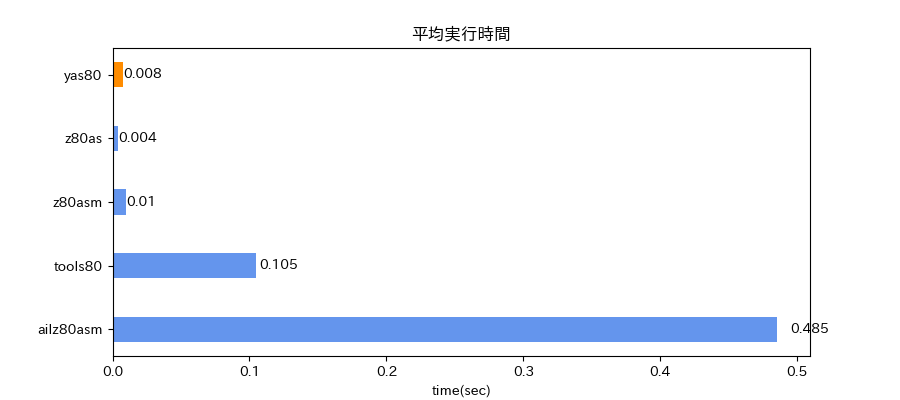
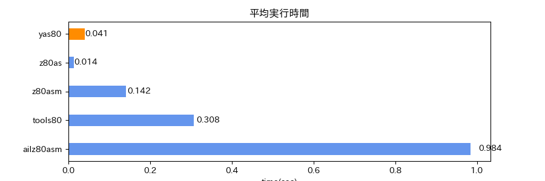
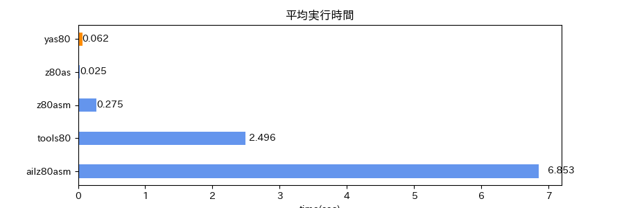

# yas80 - Yet Another Assembler for Z80 and R800

## はじめに

go で書いた Z80/R800 マクロアセンブラです。

Z80 用アセンブラは既にいくつか利用可能で私もこれまで ailz80asm を使用していて、
MZT 対応の PR 投げたりしましたが、他にもいくつか欲しい仕様が出てきました。

一方 Go 言語を使い始め、『Go 言語でつくるインタプリタ』を読んでいるうちに何か作りたくなり、
それならば Z80 アセンブラを書いてみようと思い立ち、構文解析器を手書きか、
パーサジェネレータ利用するか思案していたところ、Go 言語でもその昔齧ったことのある
yacc が利用できることがわかり、go-yacc で作りはじめ、一応形にすることができました。

こんな経緯から yas80 の "ya" は yacc の "ya" と同じです。
(Yet Another xx を使いたかっただけ)

## 主な特長

- マルチパスアセンブラ
- グローバル/PROC/マクロ スコープ
- ORG による生成コードの配置指定
- 出力は bin/mzt/t88 形式
- マルチステートメント
- 行継続
- 連続する文字列リテラルの結合
- 変数（再代入可能シンボル）
- シンボル結合演算子（##）
- 複数行関数
- 関数クロージャ
- EXITM マクロ制御構文
- JSON 文字列リテラルを指定した CHARAMP 生成
- CHARMAP 適用時の未定義文字の扱い（エラー、特定文字、元の文字）
- SETMAP による CHARMAP 変更
- 配列リテラル
- R800 命令

## 仕様

[yas80-docs](https://dogatana.github.io/yas80-docs/)

## ライセンス

[MIT](LICENSE)

## アセンブル性能

### 計測観点

アセンブル性能を計測するとともに、入手容易なアセンブラと比較したものです。
疑似命令（ディレクティブ）はアセンブラ毎の使用差が大きいので、
Z80 公開命令の範囲でアセンブル時間の比較を行ったものになります。

公開命令といえ、アセンブラによってはエラーになる場合もあるため、
それを除いた「最大公約数」的なソースになっています。

またアセンブラのシンボル管理処理に負荷をかけるという点で、
ラベルを付加したものも使用しています。

###  計測対象アセンブラ

| アセンブラ    | バージョン                | サイズ     | 備考                 | url |
|  --           | --                        | --:        | --                   | -- |
| yas80.exe     | 0.1.0 (prototype)         |  4,800,512 |                      | https://github.com/dogatana/yas80 |
| z80as.exe     | 0.12                      |    172,032 |                      | [We Love MZ-700](http://www.maroon.dti.ne.jp/youkan/mz700/index.html) |
| z80asm.exe    | 2.4                       | 39,447,620 | MSVCRT.dll 依存      | [z88dk](https://z88dk.org/site/)
| tools80.jar   | Release 6.48 (Ver. 6.6.66)|    186,306 | 要 java.exe          | [OUT of STANDARD [PC-8001]](http://upd780c1.g1.xrea.com/pc-8001/index.html#UTL) |
| ailz80asm.exe | 1.0.31.0                  | 68,322,858 | 複数 dll 依存        | https://github.com/AILight/AILZ80ASM |

### 計測対象ソース

| ソースファイル                     | 行数   | 内容                                                              |
| --                                 | --:    |  --                                                               |
| [min.asm](performance/min.asm)     |    708 | Z80 公開命令のサブセット|
| [max.asm](performance/max.asm)     | 32,340 | 生成コードが 64KB を超えない範囲で min.asm の内容を繰り返したもの |
| [label.asm](performance/label.asm) | 32,340 | max.asm の各行にラベルを付加したもの                              |

### 計測方法

- Python スクリプトで対象ソースファイルを所定回数アセンブルし、各回の実行時間を計測
- 実行時間の合計を総実行時間とし、総実行時間を回数で割った平均実行時間を求める

### 計測結果

#### min.asm 100回

|アセンブラ    | 総実行時間（秒）| 平均実行時間（秒） |
| --           |       --:       |                --: |
| yas80        |           0.781 |              0.008 |
| z80as        |           0.428 |              0.004 | 
| z80asm(z88dk)|           1.024 |              0.010 |
| tools80      |          10.500 |              0.105 |
| ailz80asm    |          48.457 |              0.485 |

#### max.asm 100回

|アセンブラ    | 総実行時間（秒）| 平均実行時間（秒） |
| --           |       --:       |                --: |
| yas80        |           4.120 |              0.041 |
| z80as        |           1.414 |              0.014 | 
| z80asm(z88dk)|          14.196 |              0.142 |
| tools80      |          30.844 |              0.308 |
| ailz80asm    |          98.436 |              0.984 |

#### label.asm 100回

|アセンブラ    | 総実行時間（秒）| 平均実行時間（秒） |
| --           |       --:       |                --: |
| yas80        |           6.243 |              0.062 |
| z80as        |           2.550 |              0.025 | 
| z80asm(z88dk)|          27.537 |              0.275 |
| tools80      |         249.643 |              2.496 |
| ailz80asm    |         685.302 |              6.853 |

## 参考

yas80 作成にあたり、次の書籍、サイトを参考にさせていただきました。

- Thorsten Ball 著、設樂 洋爾 訳. Go言語でつくるインタプリタ. O'Reilly Japan, 2018. https://www.oreilly.co.jp/books/9784873118222/  
- Jon Bodner著、武舎 広幸 訳. 初めてのGo言語 第2版. O'Reilly Japan, 2025. https://www.oreilly.co.jp/books/9784814401192/
- 近藤 嘉雪 著. yaccによるCコンパイラプログラミング. ソフトバンク, 1990
- [goyaccで構文解析を行う](https://qiita.com/k0kubun/items/1b641dfd186fe46feb65)
- [MZTファイルの仕様について覚書](https://mzakd.cool.coocan.jp/starthp/mzt.html) - [AKD's site](https://mzakd.cool.coocan.jp/main.html)
- [T88Format](https://quagma.sakura.ne.jp/manuke/t88format.html) - [Manuke Station](https://quagma.sakura.ne.jp/manuke/index_j.html)
- [DumpListEditor](https://bugfire2009.ojaru.jp/download.html) - [PC-8001を懐かしむページ](https://bugfire2009.ojaru.jp/index.html)
- z80as - [We Love MZ-700](http://www.maroon.dti.ne.jp/youkan/mz700/index.html)
- z80asm - [z88dk](https://z88dk.org/site/)
- z80as - [OUT of STANDARD [PC-8001]](http://upd780c1.g1.xrea.com/pc-8001/index.html#UTL) 
- ailz80asm  https://github.com/AILight/AILZ80ASM
